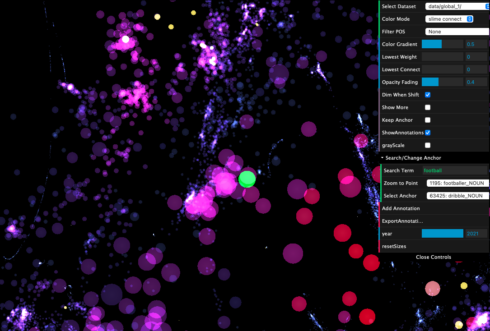
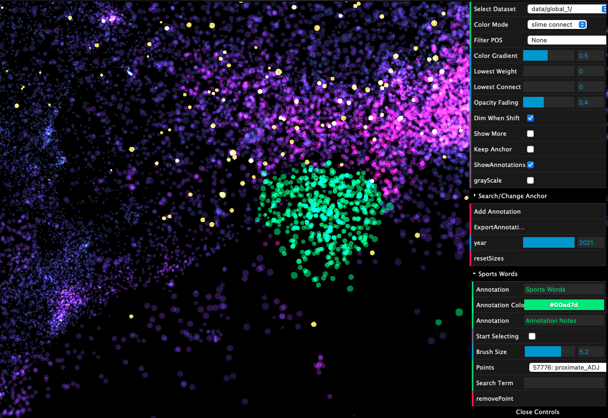
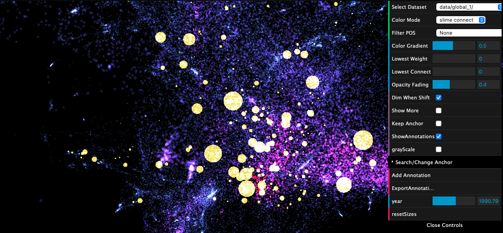
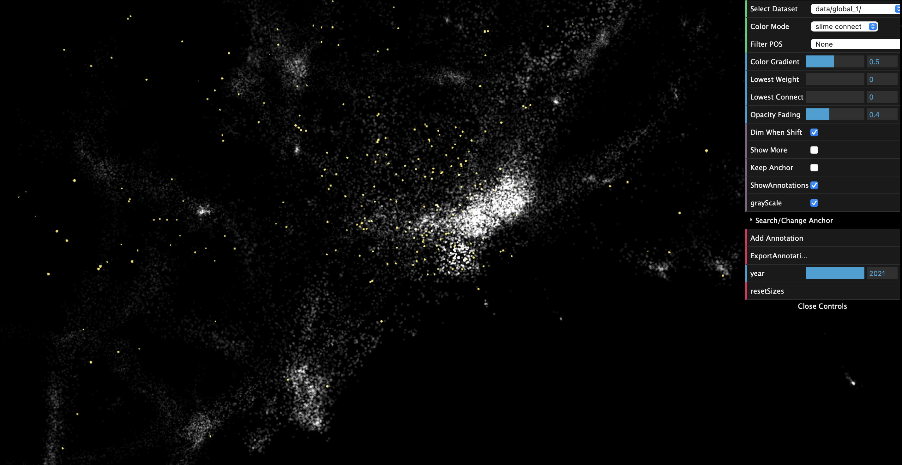
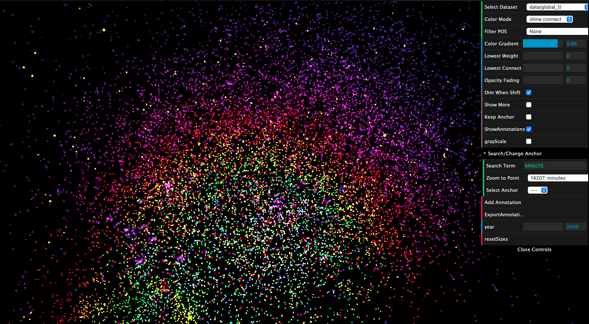

# Polyglot: Bio-inspired Visual Analysis of Language Embedding Data

This project is an extension of the Polyglot app, as developed by [Hongwei (Henry) Zhou](https://normand-1024.github.io) as part of his [master's thesis](https://escholarship.org/uc/item/6zj1r9ch), and is now a part of the PolyPhy toolkit of network-inspired data science tools (for background on the PolyPhy hub, see [here](https://github.com/PolyPhyHub)). The intention behind Polyglot is to give users a hands-on experience going beyond the standard Euclidean measure of similarity and exploring a slime-mold inspired measure of similarity, see below for more details!

Polyglot is a web application for visualizing 3D language embeddings. Language embeddings are typically high-dimensional vector representations of the syntactic and semantic content of words. By reducing the dimensionality of these representations to 3D using [UMAP](https://arxiv.org/abs/1802.03426), users are able to explore a 3D point cloud of words. Beyond navigating the 3D point cloud, the application also allows users to view the exploration result of the exciting and recent [Monte-Carlo Physarum Machine (MCPM)](https://arxiv.org/abs/2009.02459) metric. The algorithm simulates the self-organizing nature of the _Physarum polycephalum_ slime mold. This particular organism has been shown to discover optimal transport networks on its own, including an instance where it replicated the structure of the [Japanese railway system](https://www.science.org/doi/10.1126/science.1177894). The entire network is thus colored based on its MCPM similarity to the current "anchor point". The anchor point is the point from which all MCPM similarity scores are computed with respect to (e.g., if the anchor point is "football", the network is colored such that words with high MCPM similarity to "football" are brighter and dissimilar words are darker). 

The dataset displayed is the [Gensim Continuous Skipgram result of Wikipedia Dump of February 2017 (296630 words)](http://vectors.nlpl.eu/repository/). Hover over any point to examine the word. The toggle _Show More_ displays all nearby tokens, as opposed to a single word. One can switch between examining slime exploration result and part-of-speech distributions using _Color Mode_. The four sliders (_Color Gradient_, _Lowest Weight_, _Lowest Connect_, _Opacity Fading_) can be used to customize the visualization of the slime results. Specifically, _Lowest Connect_ is particularly helpful to declutter the scatter plot view.

# Background
For context, Polyglot follows this methodology:
1. Given a set of words, use an embedding model (such as Word2Vec, BERT, etc.) to generate a set of high dimensional points associated with each word.
2. Use a dimensionality reduction method (such as UMAP) to reduce the dimensionality of each word-vector point to 3 dimensions
3. Use the novel MCPM metric (Monte Carlo Physarum Machine) to compute the similarities between a set of anchor points and the rest of the point cloud.
4. The web app then displays the point cloud of 3-dimensional embeddings, but uses _coloring_ to indicate the level of MCPM similarity each word has with the anchor point (e.g, if the anchor point is the word “dog”, the rest of the point cloud is colored such that words identified as similar to “dog” by the MCPM metric are brighter, whereas dissimilar words are darker.

# Features
1. Press and hold <kbd>Shift</kbd> to see only the anchor points

2. Double click any anchor point (yellow point) to change the anchor (you will see the rest of the point cloud change color).
   
3. Fuzzy-text search bar and “jump to point” feature for smoother navigation

*Search feature. The point we have jumped to is highlighted in green.*

4. Annotation feature for coloring and making notes on subsections of the point cloud (+ ability to export annotations). A brush size selector is available and annotations can be deleted.

*Annotation feature. The annotated points are in green.*

5. Novel timeline feature in which users can track the importance of certain words over time by watching the change in size of points (computes the IF-IDF metric for a word across all documents in a given year). Uses linear interpolation for years which do not have an explicit importance score.

*Timeline feature. Yellow points are those for which timeline importance is computed. Size is relative to importance.*

6. A grayscale mode

7. An industrial collaboration with UK startup Lautonomy, where we have pre-processed and entered their data into Polyglot

*Preview of Lautonomy’s data. Coloring is based on the 3D Euclidean metric (hence the radial coloring). Data not visible in public repo.*

## Authors
This version of Polyglot was extended as part of Kiran Deol's 2023 Google Summer of Code project, mentored by [Oskar Elek](http://elek.pub) and [Jasmine Otto](https://jazztap.github.io) and is hosted as part of PolyPhy hub of bio-inspired data science tools.

This web visualization tool was originally created by a team of researchers at University of California, Santa Cruz, Dept. of Computational Media:
- [Hongwei (Henry) Zhou](https://normand-1024.github.io/)
- [Oskar Elek](https://elek.pub/)
- [Angus G. Forbes](https://creativecoding.soe.ucsc.edu/angus/)

This work was published as Hongwei Zhou's [M.S. thesis](https://escholarship.org/uc/item/6zj1r9ch#main).

A version of the original work was published in [2020 IEEE 5th Workshop on Visualization for the Digital Humanities (VIS4DH)](https://www.computer.org/csdl/proceedings-article/vis4dh/2020/915300a007/1pZ0Xs0EEqk)
